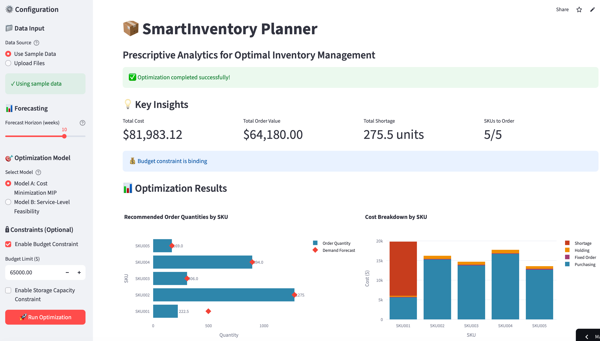
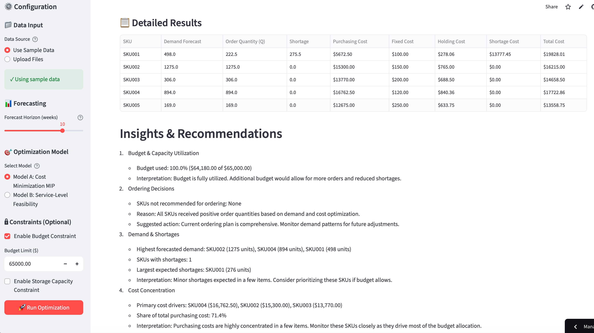

# SmartInventory Planner

**Prescriptive Analytics for Optimal Inventory Management**

---

## The Problem

Consider a typical small e-commerce operator managing 50-200 SKUs. Every week, they face the same dilemma: **How much should I order for each product?**

Currently, most operators rely on Excel spreadsheets and gut feeling. They look at last month's sales, add a "safety buffer," and hope for the best. This approach leads to three critical problems:

1. **Overstocking**: Ordering too much ties up working capital and increases holding costs. A small seller with a $10,000 monthly budget might accidentally allocate $6,000 to slow-moving items, leaving only $4,000 for high-demand products.

2. **Understocking**: Ordering too little causes stockouts, especially for popular items. When a trending product runs out, customers go to competitors. The lost sales opportunity plus the cost of expedited reordering can easily exceed the original product margin.

3. **Inefficient Resource Allocation**: Without a systematic approach, it's impossible to balance competing constraints: limited budget, warehouse capacity, fixed order costs, and the need to maintain service levels across all SKUs.

As the number of SKUs grows, manual decision-making becomes exponentially more complex. A seller managing 100 SKUs must make 100 interdependent decisions, each affecting the others through shared budget and capacity constraints. This is where intuition fails and optimization becomes essential.

Traditional inventory management methods fall short in this multi-SKU, constrained environment. Classical Economic Order Quantity (EOQ) models assume single-SKU optimization with unlimited resources, ignoring budget constraints and cross-SKU tradeoffs. Heuristic rules and spreadsheet-based approaches cannot simultaneously optimize across all SKUs while respecting capacity and budget limits. Descriptive analytics merely report what happened in the past, while predictive models forecast demand but stop short of prescribing optimal actions. Prescriptive analytics, by contrast, solves an optimization problem that explicitly considers all constraints and objectives, producing mathematically optimal recommendations that balance cost efficiency, service levels, and resource constraints across the entire product portfolio.

---

## The Solution

**SmartInventory Planner** transforms inventory planning from guesswork into a data-driven optimization problem. The application takes three inputs:

1. **Historical sales data** (date, SKU, demand) - automatically aggregated to weekly totals
2. **SKU parameters** (unit cost, holding cost, stockout penalty, volume, fixed order cost)
3. **Business constraints** (budget limit, warehouse capacity, forecast horizon)

The system then:

- **Forecasts demand** using a simple moving average (average weekly demand × forecast horizon)
- **Solves a mixed-integer programming (MIP) model** to find optimal order quantities
- **Outputs actionable recommendations**: exactly how much to order for each SKU, along with cost breakdowns and constraint analysis

### Two Model Options

**Model A: Cost Minimization MIP** - Minimizes total cost (purchasing + fixed order + holding + shortage) under budget and capacity constraints. Ideal for businesses focused on cost efficiency.

**Model B: Service-Level Feasibility** - Prioritizes minimizing stockouts by heavily penalizing shortages. Ideal for businesses where customer satisfaction is paramount, even if it means higher total costs.

Users can switch between models to explore tradeoffs between cost and service level, enabling data-driven decision-making that balances multiple business objectives.

---

## Analytics Approach

We formulate the inventory planning problem as a **mixed-integer program (MIP)** with decision variables for order quantities, binary order indicators, and shortage amounts. Classical inventory models are insufficient for this multi-SKU, constrained setting.

---

## Live Demo

👉 **Try the Live Demo:** [SmartInventory Planner](https://willzh2025-smartinventory-planner.streamlit.app/)

**Screenshot**:


---

## How It Works

The application follows a clear prescriptive analytics pipeline: **Data → Mathematical Model → Actionable Recommendations**.

### Step 1: Data Input & Forecasting
Users upload historical sales data (date, SKU, demand) and SKU parameter files (costs, penalties, volumes). The application:
- Aggregates daily sales to weekly totals
- Calculates average weekly demand using a simple moving average
- Projects future demand: `Forecasted Demand = Average Weekly Demand × Forecast Horizon (weeks)`

This deterministic forecast ($D_i$ for each SKU $i$) becomes the input to the optimization model.

### Step 2: Optimization (The Prescriptive Core)
The application formulates the inventory planning problem as a **mixed-integer program (MIP)** with:
- **Decision variables**: Order quantities ($Q_i$), order indicators ($y_i$), and shortages ($s_i$)
- **Objective function**: Minimize total cost (purchasing + fixed + holding + shortage)
- **Constraints**: Budget limits, capacity limits, shortage definitions, fixed cost triggers

The model is solved using **Gurobi** (primary) or **SciPy** (fallback), producing optimal order quantities for each SKU.

### Step 3: Results & Visualization
The application presents **actionable recommendations**:
- **Order Quantity Chart**: Horizontal bar chart showing exactly how much to order for each SKU
- **Cost Breakdown Chart**: Stacked bar chart showing cost components (purchasing, fixed, holding, shortage) by SKU
- **Results Table**: Detailed metrics including demand forecasts, optimal order quantities, expected shortages, and cost breakdowns
- **Insights**: Plain-language summary (e.g., "Budget constraint is binding; SKUs X and Y account for 60% of total spend")

---

## The Analytics Behind It

The objective is to minimize total purchasing, holding, and shortage costs under budget and capacity constraints. The model is solved with **Gurobi** (primary solver), with a **SciPy** fallback for environments without a Gurobi license.

This is a **prescriptive analytics** approach because it:
- Takes historical data and business constraints as inputs
- Solves an optimization problem to find the mathematically optimal solution
- Outputs actionable recommendations (exact order quantities) rather than just descriptive statistics or predictions

### Mathematical Formulation

#### Model A: Cost Minimization MIP

**Decision Variables**:
- $Q_i \geq 0$: Order quantity for SKU $i$
- $y_i \in \{0,1\}$: Binary variable indicating whether SKU $i$ is ordered
- $s_i \geq 0$: Shortage amount for SKU $i$

**Objective Function**:
$$\min \sum_{i} \left[ c_i Q_i + F_i y_i + h_i \frac{Q_i}{2} + p_i s_i \right]$$

Where:
- $c_i$: Unit cost for SKU $i$
- $F_i$: Fixed order cost for SKU $i$
- $h_i$: Holding cost per unit for SKU $i$
- $p_i$: Stockout penalty per unit for SKU $i$

**Constraints**:

1. **Shortage Definition**: $s_i \geq D_i - Q_i$, $s_i \geq 0$ for all $i$
   - Ensures shortage captures unmet demand (if $Q_i < D_i$, then $s_i = D_i - Q_i$; otherwise $s_i = 0$)

2. **Fixed Cost Trigger**: $Q_i \leq M \cdot y_i$ for all $i$
   - Links binary variable to order quantity (Big-M formulation, where $M$ is a sufficiently large number)
   - Ensures fixed cost $F_i$ is incurred only when $y_i = 1$ (i.e., when ordering)

3. **Budget Constraint** (optional): $\sum_i (c_i Q_i + F_i y_i) \leq \text{Budget}$
   - Limits total purchasing cost ($c_i Q_i$) plus fixed order costs ($F_i y_i$)

4. **Storage Capacity** (optional): $\sum_i v_i Q_i \leq \text{Capacity}$
   - Limits total inventory volume, where $v_i$ is the volume per unit of SKU $i$

#### Model B: Service-Level Feasibility

**Decision Variables**:
- $Q_i \geq 0$: Order quantity for SKU $i$
- $s_i \geq 0$: Shortage amount for SKU $i$

**Objective Function**:
$$\min \sum_{i} \left[ p_i \cdot \alpha \cdot s_i \right]$$

Where $\alpha$ is a large multiplier (default: 10) that heavily penalizes shortages.

**Constraints**:
1. **Shortage Definition**: $s_i \geq D_i - Q_i$ for all $i$
2. **Budget Constraint** (optional): $\sum_i c_i Q_i \leq \text{Budget}$

### Why This Optimization Model Is the Right Choice

The Economic Order Quantity (EOQ) model optimizes each SKU independently, ignoring shared budget and capacity constraints that create interdependencies across products. The newsvendor model addresses single-period, single-SKU decisions under uncertainty but cannot handle multiple SKUs with fixed order costs and resource constraints simultaneously. Heuristic approaches, such as ordering based on demand-to-cost ratios or simple priority rules, fail to capture the complex tradeoffs between purchasing costs, holding costs, shortage penalties, and fixed order costs across the entire portfolio.

A mixed-integer programming (MIP) formulation is the appropriate choice because it explicitly models budget constraints, capacity limits, and fixed order costs through binary decision variables, enabling simultaneous optimization across all SKUs. The MIP framework naturally handles the discrete decision of whether to order each SKU (via $y_i$) while optimizing continuous order quantities ($Q_i$), ensuring that fixed costs are only incurred when orders are placed. Model A provides cost-minimizing solutions under resource constraints, while Model B offers a service-level-focused alternative that heavily penalizes shortages, together creating a full decision spectrum that allows managers to explore tradeoffs between cost efficiency and customer satisfaction. This prescriptive modeling approach is superior to heuristics because it guarantees mathematical optimality given the specified objectives and constraints, rather than relying on rules of thumb that may perform well in some scenarios but fail in others.

### Why This Model is Prescriptive

This model is **prescriptive** (not just descriptive or predictive) because:

1. **Actionable Recommendations**: It directly outputs order quantities ($Q_i$) that decision-makers should implement, not just forecasts or historical summaries.

2. **Optimization-Based**: It solves an optimization problem that finds the mathematically optimal solution given objectives and constraints, rather than applying heuristics or rules of thumb.

3. **Constraint-Aware**: It explicitly incorporates real-world constraints (budget, capacity) that limit feasible actions, ensuring recommendations are implementable.

4. **Trade-off Analysis**: By optimizing an objective function that balances multiple cost components, it automatically performs trade-off analysis (e.g., ordering more to avoid shortages vs. saving on holding costs).

5. **Decision Support**: The binary variables ($y_i$) in Model A make discrete decisions (whether to order), which is a key characteristic of prescriptive analytics.

### Forecasting Approach

The application uses a **simple moving average** for demand forecasting:
- Sales data is aggregated to weekly totals
- Average weekly demand is calculated over available historical data
- Forecasted demand = Average weekly demand × Forecast horizon (weeks)

This deterministic forecast is then used as input ($D_i$) to the optimization model.

---

## Example Output

👉 **Try the Live Demo:** [SmartInventory Planner](https://willzh2025-smartinventory-planner.streamlit.app/)



The application provides:
- **Recommended order quantities** for each SKU
- **Cost breakdown** showing purchasing, fixed, holding, and shortage costs
- **Binding constraint indicators** showing which constraints are limiting the solution
- **Total cost metrics** and summary statistics

### Interpretation & Key Insights

The optimization results provide actionable business intelligence beyond simple order quantities:

- **Binding Constraints**: When the budget constraint is binding, the model has allocated the entire available budget, indicating that increasing the budget would allow for additional orders and potentially reduce shortage costs. Similarly, a binding capacity constraint suggests that warehouse space is the limiting factor, and the business should consider expanding storage or prioritizing high-margin, low-volume SKUs.

- **SKU Prioritization Patterns**: The model naturally prioritizes SKUs with favorable cost-to-penalty ratios. High-demand SKUs with low unit costs and high stockout penalties receive larger order allocations, while low-margin or slow-moving items may receive zero orders when budget is constrained, signaling potential candidates for product line rationalization.

- **Trade-off Behavior**: In Model A, the solution balances holding costs against shortage penalties. SKUs with expensive holding costs relative to stockout penalties may show lower order quantities, accepting some shortage risk to minimize total cost. Model B, by contrast, aggressively minimizes shortages, often resulting in higher total costs but superior service levels.

- **Optimal Zero Orders**: When a SKU receives zero order quantity, it indicates that the fixed order cost, combined with low demand or high holding costs, makes ordering unprofitable under the current constraints. This insight helps identify SKUs that should be discontinued or renegotiated with suppliers to reduce fixed costs.

- **Budget Allocation Shifts**: As budget constraints tighten, the model shifts orders from lower-priority SKUs to higher-priority ones. Observing which SKUs lose orders first provides insight into product portfolio resilience and helps managers understand which items are most critical to business operations.

---

## Technology Stack

- **Frontend**: Streamlit (Python web framework)
- **Optimization**: 
  - Gurobi Optimizer (primary solver)
  - SciPy (fallback for environments without Gurobi)
- **Data Processing**: Pandas, NumPy
- **Visualization**: Plotly
- **Language**: Python 3.8+

### Installation

```bash
# Install required packages
pip install streamlit pandas numpy plotly scipy

# Optional: Install Gurobi for better performance
# Follow Gurobi installation instructions at: https://www.gurobi.com/documentation/
```

### Running the Application

```bash
cd smartinventory
streamlit run app.py
```

---

## About This Project

This project was developed for **ISOM 839 - Prescriptive Analytics (Fall 2025)** as a demonstration of prescriptive analytics principles applied to a real-world inventory management problem.

**Key Learning Objectives Demonstrated**:
- Formulation of optimization models (MIP and LP)
- Integration of forecasting with optimization
- Development of interactive prescriptive analytics applications
- Translation of business problems into mathematical models

**Project Structure**:
```text
smartinventory/
│
├── sample_data/
│   ├── sales_history_sample.csv
│   └── sku_costs_sample.csv
│
├── __init__.py
├── app.py
├── data_loader.py
├── insights.py
├── optimizer.py
└── visualization.py
```

---

## Future Possibilities

Potential enhancements and extensions:

1. **Stochastic Optimization**: Incorporate demand uncertainty through scenario-based or robust optimization approaches
2. **Multi-Period Planning**: Extend to multi-period models with inventory carryover between periods
3. **Supplier Constraints**: Add constraints for minimum order quantities, supplier capacity limits
4. **Advanced Forecasting**: Integrate time series models (ARIMA, exponential smoothing) for more accurate demand predictions
5. **What-If Analysis**: Interactive scenario analysis tools to explore different constraint values
6. **Integration**: Connect to e-commerce platforms (Shopify, WooCommerce) for automated data import
7. **Machine Learning**: Use ML models to predict demand patterns and optimize accordingly
8. **Real-time Updates**: Continuous optimization as new sales data arrives

---

## Demo Video

**Video Link**: [Placeholder - Add YouTube/Vimeo link here]

*Note: Replace with actual demo video link*

---

## License

This project is developed for educational purposes as part of ISOM 839 coursework.

---

## Author

**Author: Will Zhong**

ISOM 839 - Prescriptive Analytics  
Fall 2025
